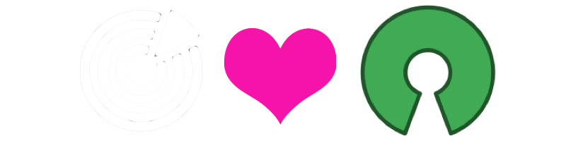

## Socrata APIs
### Socrata 2015 Partner Summit

===

<h3> chrismetcalf</h3>

===

# Open Data vs. Open APIs

===

# Why is just Open Data not enough?

---

## A downloaded dataset is a stale dataset&lowast;

&lowast; Metcalf's Law. I call dibs.

---

## Don't make me build my own API

---

## More sustainable and portable

===

# Why not just APIs?

---

## A gated experience

---

## APIs go away

---

## You can't anticipate every use case

===

## Why not both?

===

# Open Data 
# +
# Open APIs

===

# The Socrata Open Data APIs

---

---

---

### In the Data Catalog

---

## Example: Chicago Restaurant Inspections

[data.cityofchicago.org/.../.../2bnm-jnvb](https://data.cityofchicago.org/d/2bnm-jnvb)

---

## Simple Filters

<code>
/resource/cwig-ma7x.json?facility_type=Restaurant
</code>

<pre><code data-trim contenteditable class="javascript">
[ {
    "address": "2020 W CHICAGO ",
    "aka_name": "BAR BARI",
    "dba_name": "BAR BARI",
    "facility_type": "Restaurant",
    "inspection_date": "2011-09-12T00:00:00.000",
    "inspection_id": "634525",
    "inspection_type": "Canvass",
    "latitude": "41.896004699879654",
    "license_": "2109874",
    "location": {
      "type": "Point",
      "coordinates": [ -87.677938, 41.896005 ]
    },
    "longitude": "-87.6779378973854",
    "results": "Pass",
    "risk": "Risk 1 (High)",
    "state": "IL",
    "zip": "60622"
}, ... ]
</code></pre>

---

## SoQL Queries

<code>
/resource/cwig-ma7x.json? 
$where=within_circle(location, 41.88, -87.63, 1000)
</code>

<small style="padding-top: 5em">For more details see <a href="http://dev.socrata.com">dev.socrata.com</a></small>

---

## Aggregating Data

<code>
/resource/cwig-ma7x.json? 
$select=DATE_TRUNC_YM(date) AS month, COUNT(inspection_id) AS total 
&amp;results=fail 
&amp;$group=month 
</code>

<pre><code data-trim contenteditable class="javascript">
[ {
"total": "1672",
"month": "2013-10-01T00:00:00"
}, ... ]
</code></pre>

---

## Paging Through Data

<code contenteditable>
/resource/cwig-ma7x.json? 
$limit=50 
&amp;$offset=100
</code>

---

## Application Tokens

1. Register at [http://dev.socrata.com/register](http://dev.socrata.com/register)
2. Include as:
  - <code>X-App-Token: $token</code> HTTP Header or ... 
  - The <code>$$app_token=$token</code> URL parameter
3. Profit!!! (from more API requests)

===

# The Socrata Publisher APIs

---

## Overview

Follows the same paradigms as the consumer APIs:

* Same `REST`ful endpoint as the dataset&#42;
* Supports `JSON`, `XML`, `CSV`, etc.
* Bulk and metadata update interfaces also available

---

## Example: Adding a new fire 911 report

<pre><code contenteditable>
POST https://data.cityofchicago.org/resource/ijzp-q8t2.json
Content-type: application/json
Authorization: Basic [REDACTED]
X-App-Token: CGxaHQoQlgQSev4zyUh5aR5J3

[ {
    "inspection_id": "634525",
    "address": "2020 W CHICAGO ",
    ...,
    "license_": "2109874",
    "location": {
      "type": "Point",
      "coordinates": [ -87.677938, 41.896005 ]
    },
    "longitude": "-87.6779378973854",
    "results": "Pass",
    "risk": "Risk 1 (High)",
    "state": "IL",
    "zip": "60622"
}, ... ]
</code></pre>
</code></pre>

---

## Publisher Client Libraries

Libraries or examples available for:

* [Java](https://github.com/socrata/soda-java)
* [Scala](https://github.com/socrata/soda-scala)
* [Ruby](https://github.com/socrata/soda-ruby)
* ...

[dev.socrata.com/libraries/](http://dev.socrata.com/libraries/)

---

## Publisher Tools

Tools for streamlined integration:

* [Datasync](http://socrata.github.io/datasync/)
* [Safe FME](http://www.safe.com/)
* [Pentaho Kettle](http://dev.socrata.com/publishers/cookbooks/pentaho-kettle-etl-kit.html)

===

# Socrata Labs

### [labs.socrata.com](http://labs.socrata.com)
---

## Catalog Search

---

## Export Service

===

# Help!

---

## Developer Portal

# [dev.socrata.com](http://dev.socrata.com)

Community powered! Learn how to <a href="http://dev.socrata.com/contributing.html">contribute</a>.

---

## Libraries &amp; SDKs

### [dev.socrata.com/libraries/](http://dev.socrata.com/libraries/)

<a href="http://socrata.github.io/soda-ruby/">Ruby</a>, <a href="https://github.com/socrata/soda-scala">Scala</a>, <a href="http://socrata.github.io/soda-java/">Java</a>, <a href="https://github.com/socrata/soda-ios-sdk">ObjectiveC</a>, <a href="https://github.com/Chicago/RSocrata">R</a>, <a href="https://github.com/socrata/soda-swift">Swift</a>, etc.

--- 

## Questions or Issues?

- Chase me down!
- IRC: [chat.freenode.net/#socrata-soda](irc://chat.freenode.net/#socrata-soda)
- Stack Overflow: [soda](http://stackoverflow.com/questions/tagged/soda) or [socrata](http://stackoverflow.com/questions/tagged/socrata)

===

# Live Tutorial

## <http://tmpl.at/1JqL2YS>

===

# Questions?

