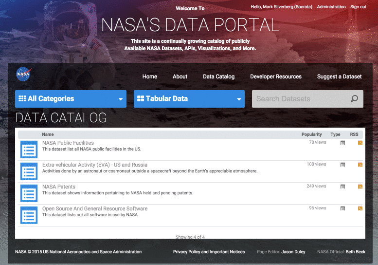

## 2015 Space Apps NYC
## Intro to NASA Open Data APIs

===

<h1>Who the heck are you?</h1>

---

<h2>We build software to make data more useful to more people.</h2>

<!-- https://www.flickr.com/photos/hyku/2497370097 -->
--- 

<h2>We believe that greater access to  data makes this universe a better places to live</h2>

---

<h2>We make it easy for organizations to share their public data with developers</h2>

===

# The Socrata Open Data APIs

---

## Finding Data 
 
### `==>` [data.nasa.gov](https://data.nasa.gov/) `<==`
 
### [spaceappschallenge.org](https://2015.spaceappschallenge.org/challenge/)
### [dev.socrata.com/data](http://dev.socrata.com/data/)

---

## API Endpoints

Format:

<code>https://$domain/resource/$identifier.ext</code>

---

### In the Data Catalog

---

## Simple Filters

<code>http://data.nasa.gov/resource/b67r-rgxc.json?<code>
<code>object_name=263P/Gibbs</code>

<pre><code data-trim contenteditable class="javascript">
[
  {
    "object": "263P/Gibbs",
    "object_name": "263P/Gibbs",
    "e": "0.5869803961",
    "w_deg": "26.31548584",
    "moid_au": "0.284398",
    "epoch_tdb": "54246",
    "q_au_2": "4.81",
    "q_au_1": "1.251302076",
    "tp_tdb": "2454098.266",
    "ref": "15",
    "p_yr": "5.27",
    "i_deg": "14.4711765",
    "node_deg": "113.3508576"
  }
]
</code></pre>

---

## SoQL Queries

<code>http://data.nasa.gov/resource/b67r-rgxc.json?<code>
<code>
$where=p_yr &lt; 5 AND epoch_tdb &gt; 55000
</code>

<small style="padding-top: 5em">For more details see <a href="http://dev.socrata.com">dev.socrata.com</a></small>

---

## Aggregating Data

<code>http://data.nasa.gov/resource/b67r-rgxc.json?<code>
<code>
$select=e,count(e) &amp;$group=e &amp;$order=count_e DESC
</code>

<pre><code data-trim contenteditable class="javascript">
[
  {
    "count_e": "7",
    "e": "0.6933582332"
  },
  {
    "count_e": "4",
    "e": "0.6824392137"
  },
  {
    "count_e": "2",
    "e": "0.6824329214"
  },
  {
    "count_e": "1",
    "e": "0.9671429085"
  }, ...
]
</code></pre>

---

## Paging Through Data

<code contenteditable>
/resource/abcd-1234.json? 
$limit=50 
&amp;$offset=100
</code>

---

## Application Tokens

1. Register at [http://dev.socrata.com/register](http://dev.socrata.com/register)
2. Include as:
  - <code>X-App-Token: $token</code> HTTP Header or ... 
  - The <code>$$app_token=$token</code> URL parameter
3. Profit!!! (from more API requests)

===

# Help!

---

## Developer Portal

# [dev.socrata.com](http://dev.socrata.com)

Community powered! Learn how to <a href="http://dev.socrata.com/contributing.html">contribute</a>.

--- 

## Getting Help

- In person
- IRC: [chat.freenode.net/#socrata-soda](irc://chat.freenode.net/#socrata-soda)
- Stack Overflow: [soda](http://stackoverflow.com/questions/tagged/soda) or [socrata](http://stackoverflow.com/questions/tagged/socrata)

---

## Libraries &amp; SDKs

### [dev.socrata.com/libraries/](http://dev.socrata.com/libraries/)

<a href="http://socrata.github.io/soda-ruby/">Ruby</a>, <a href="https://github.com/socrata/soda-scala">Scala</a>, <a href="http://socrata.github.io/soda-java/">Java</a>, <a href="https://github.com/socrata/soda-ios-sdk">ObjectiveC</a>, <a href="https://github.com/Chicago/RSocrata">R</a>, <a href="https://github.com/socrata/soda-swift">Swift</a>, etc.

===

## One more thing...

<h1 class="fragment" data-fragment-index="0">We're hiring!</h1>

<h2 class="fragment" data-fragment-index="1"><a href="http://www.socrata.com/careers">www.socrata.com/careers</a></h2>

===

# Thanks!

===

