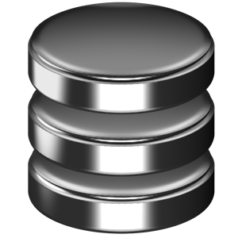
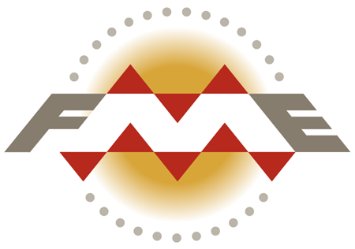

# Socrata University
## API School

  [@chrismetcalf](http://twitter.com/chrismetcalf)

===

# Who the heck are you?

---

<h2>We build software to make data more useful to more people.</h2>

---

---

<a href="http://data.edmonton.ca" style="font-size: 0.9035870402333326em; color: #ff9c4e">data.edmonton.ca</a> <a href="http://finances.worldbank.org" style="font-size: 0.8772951426467999em; color: #f513aa">finances.worldbank.org</a> <a href="http://data.cityofchicago.org" style="font-size: 0.8563282192850427em; color: #49f071">data.cityofchicago.org</a> <a href="http://data.seattle.gov" style="font-size: 1.0113351991377095em; color: #ff9c4e">data.seattle.gov</a> <a href="http://data.oregon.gov" style="font-size: 1.0632000405122985em; color: #ffe34e">data.oregon.gov</a> <a href="http://data.wa.gov" style="font-size: 1.1467716657173754em; color: #f513aa">data.wa.gov</a> <a href="http://www.metrochicagodata.org" style="font-size: 1.1728588452112927em; color: #49f071">www.metrochicagodata.org</a> <a href="http://data.cityofboston.gov" style="font-size: 1.1361943315973417em; color: #ff9c4e">data.cityofboston.gov</a> <a href="http://info.samhsa.gov" style="font-size: 1.1316050277786331em; color: #ffe34e">info.samhsa.gov</a> <a href="http://explore.data.gov" style="font-size: 1.062317212822309em; color: #49f071">explore.data.gov</a> <a href="http://data.cms.gov" style="font-size: 1.0660574549214934em; color: #49f071">data.cms.gov</a> <a href="http://data.ok.gov" style="font-size: 1.162736854995904em; color: #f513aa">data.ok.gov</a> <a href="http://data.nola.gov" style="font-size: 1.126505050300791em; color: #ffca14">data.nola.gov</a> <a href="http://data.illinois.gov" style="font-size: 1.177374336683778em; color: #f513aa">data.illinois.gov</a> <a href="http://data.colorado.gov" style="font-size: 1.001052214697448em; color: #ff9c4e">data.colorado.gov</a> <a href="http://data.austintexas.gov" style="font-size: 1.124727735232786em; color: #f513aa">data.austintexas.gov</a> <a href="http://data.undp.org" style="font-size: 1.1124439375453006em; color: #f513aa">data.undp.org</a> <a href="http://www.opendatanyc.com" style="font-size: 0.8712428632285159em; color: #12daeb">www.opendatanyc.com</a> <a href="http://data.mo.gov" style="font-size: 0.9029850703557044em; color: #ffe34e">data.mo.gov</a> <a href="http://data.nfpa.org" style="font-size: 1.012872911193062em; color: #ff9c4e">data.nfpa.org</a> <a href="http://data.raleighnc.gov" style="font-size: 0.9086882003859384em; color: #12daeb">data.raleighnc.gov</a> <a href="http://dati.lombardia.it" style="font-size: 0.9039858675056424em; color: #49f071">dati.lombardia.it</a> <a href="http://data.montgomerycountymd.gov" style="font-size: 0.9352653110386874em; color: #12daeb">data.montgomerycountymd.gov</a> <a href="http://data.cityofnewyork.us" style="font-size: 1.1265759882837703em; color: #ffca14">data.cityofnewyork.us</a> <a href="http://data.acgov.org" style="font-size: 0.9437766738336744em; color: #ffe34e">data.acgov.org</a> <a href="http://data.baltimorecity.gov" style="font-size: 0.882579426803236em; color: #ff9c4e">data.baltimorecity.gov</a> <a href="http://data.energystar.gov" style="font-size: 0.8117560767109612em; color: #f513aa">data.energystar.gov</a> <a href="http://data.somervillema.gov" style="font-size: 1.186507877285259em; color: #12daeb">data.somervillema.gov</a> <a href="http://data.maryland.gov" style="font-size: 1.1530969164867597em; color: #49f071">data.maryland.gov</a> <a href="http://data.taxpayer.net" style="font-size: 0.9440308901295145em; color: #49f071">data.taxpayer.net</a> <a href="http://bronx.lehman.cuny.edu" style="font-size: 1.137302902999452em; color: #f513aa">bronx.lehman.cuny.edu</a> <a href="http://data.hawaii.gov" style="font-size: 0.8638436634481809em; color: #49f071">data.hawaii.gov</a> <a href="http://data.sfgov.org" style="font-size: 0.8240410381260401em; color: #f513aa">data.sfgov.org</a> <a href="http://data.cityofmadison.com" style="font-size: 1.1636966314697277em; color: #ff9c4e">data.cityofmadison.com</a> <a href="http://healthmeasures.aspe.hhs.gov" style="font-size: 1.1052267008290044em; color: #ffe34e">healthmeasures.aspe.hhs.gov</a>

===

# So what is an API anyway?

---

  Application 
  Programming 
  Interface

---

# Common Language

A consistent way for two software systems to communicate.

---

# Stable Platform

A guarantee that the language will not change without notice.
    
---

# Contract

An API is a contract between a provider and a consumer.

===

# Why are APIs important?

---

## Open data is messy

<pre>
C00000042|ILLINOIS TOOL WORKS FOR BETTER GOVERNMENT COMMITTEE|Michael J. Lynch|3600 W. Lake Avenue||Glenview|IL|60025|U|Q||Q|C|ILLINOIS TOOL WORKS INC|
C00000059|HALLMARK CARDS PAC|Swarens, Greg|2501 McGee|MD #288|Kansas City|MO|64108|U|Q|UNK|M|C|HALLMARK CARDS INCORPORATED|
C00000422|AMERICAN MEDICAL ASSOCIATION POLITICAL ACTION COMMITTEE|WALKER, KEVIN|25 MASSACHUSETTS AVENUE NW|SUITE 600|WASHINGTON|DC|20001|U|Q||M|M|AMERICAN MEDICAL ASSOCIATION|
C00000489|D R I V E POLITICAL FUND, CHAPTER 886|RON COBB|3528 WEST RENO||OKLAHOMA CITY|OK|73107|U|Q||Q|L|TEAMSTERS LOCAL UNION 886|
C00000547|KANSAS MEDICAL SOCIETY POLITICAL ACTION COMMITTEE|C. RICHARD BONEBRAKE, M.D.|623 SW 10TH AVE||TOPEKA|KS|66612|U|Q|UNK|Q|T|MEDICAL ASS'N; KANSAS          [AMPAC]|
C00000638|INDIANA STATE MEDICAL ASSOCIATION POLITICAL ACTION COMMITTEE|Kora, M.D., Vidya|322 Canal Walk, Canal Level|.|Indianapolis|IN|46202|U|Q||Q|M|Indiana State Medical Association|
C00000729|AMERICAN DENTAL POLITICAL ACTION CMTE.|Triftshauser, Roger W|1111 14th Street NW|Suite 1100|Washington|DC|20005|U|Q|UNK|M|T|DENTAL ASS'N; AMERICAN|
</pre>

Courtesy of <a href="ftp://ftp.fec.gov">ftp.fec.gov</a>
    
---
    
## A downloaded dataset is a stale dataset

---

## Developers don’t want to manage custom datastores

---

## You want apps to be easily portable

===

# The Socrata Open Data APIs

---

## API Endpoints

Format:

<code>https://$domain/resource/$identifier.$ext</code>

---

### In the Data Catalog

---

## Simple Filters

<code>
/resource/abcd-1234.json?source=ConEd
</code>

<pre><code data-trim contenteditable class="javascript">
[ {
  "zipcode" : "10001",
    "source" : "ConEd",
    "location" : {
      "longitude" : "-73.99688630375988",
      "latitude" : "40.75025902143676",
    },
    "building_type" : "Commercial",
    "kwh" : "23328498"
}, ... ]
</code></pre>

---

## SoQL Queries

<code>
/resource/abcd-1234.json? 
$where=kwh &gt; 80000
</code>

<small style="padding-top: 5em">For more details see <a href="http://dev.socrata.com">dev.socrata.com</a></small>

---

## Geo Queries

<code>
/resource/abcd-1234.json? 
$where=within_circle(location, 47.61, -122.32, 500)
</code>

For more info: <a href="http://dev.socrata.com/docs/datatypes/location.html">dev.socrata.com/docs/datatypes/location.html</a>

---

## Aggregating Data

<code>
/resource/abcd-1234.json? 
$select=source, sum(kwh) 
&amp;$group=source
</code>

<pre><code data-trim contenteditable class="javascript">
[ {
  "source" : "ConEd",
    "sum_kwh" : "49469570957"
}, {
  "source" : "Long Island Power Authority",
    "sum_kwh" : "445333629"
}, ... ]
</code></pre>

---

## Paging Through Data

<code contenteditable>
/resource/abcd-1234.json? 
$limit=50 
&amp;$offset=100
</code>

---

## Application Tokens

1. Register at [http://dev.socrata.com/register](http://dev.socrata.com/register)
2. Include as:
- <code>X-App-Token: $token</code> HTTP Header or ... 
  - The <code>$$app_token=$token</code> parameter
3. Profit!!! (from more API requests)

---

## API Foundry

The best way of making your API deployment effort successful rapidly and easily:

* Create a customized, friendly API
* Custom documentation and code samples automatically created
* Powerful API management and throttling tools

[http://www.socrata.com/api-foundry/](http://www.socrata.com/api-foundry/)

---

# Consumer API Demo!

===

# Publishing Strategies

---

## Initial Import?
## Archival Dataset?
## Infrequent Changes?

There's no need for an API integration. Use the web tools!

---

## Daily or Weekly Updates?
## Complete replacement?
## Comes from an ETL system?

Use DataSync or Safe FME

---

## Real-time updates?
## Data that morphs over time?

Use the RESTful API

===

# DataSync!

===

# Safe FME

===

# The Socrata Publisher APIs

---

## Overview

Follows the same paradigms as the consumer APIs:

* Same `REST`ful endpoint as the dataset
* Supports `JSON`, `XML`, `CSV`, etc.
* Bulk and metadata update interfaces also available

---

## Example: Adding a new fire 911 report

<pre><code contenteditable>
POST https://data.seattle.gov/resource/kzjm-xkqj.json
Content-type: application/json
Authorization: Basic [REDACTED]
X-App-Token: CGxaHQoQlgQSev4zyUh5aR5J3
[
  {
    "address": "1402 E Pike St",
      "longitude": "-122.314118",
      "latitude": "47.614121",
      "incident_number": "F120079189",
      "datetime": 1345675560,
      "type": "Motor Vehicle Accident",
      "report_location": {
        "longitude": "-122.314118",
        "latitude": "47.614121"
      }
  }
]
</code></pre>

---

## Publisher Client Libraries

Libraries or examples available for:

* [Java](https://github.com/socrata/soda-java)
* [Scala](https://github.com/socrata/soda-scala)
* [Ruby](https://github.com/socrata/soda-ruby)
* More coming soon...

[http://github.com/socrata](http://github.com/socrata)

===

# Help!

---

## Developer Portal

[http://dev.socrata.com](http://dev.socrata.com)

File issues and pull requests!

<http://github.com/socrata/dev.socrata.com>

---

## Get Support

  [http://support.socrata.com](http://support.socrata.com)

---

## Contact Me

[chris.metcalf@socrata.com](mailto:chris.metcalf@socrata.com)

[support@socrata.com](mailto:support@socrata.com)

[@chrismetcalf](http://twitter.com/chrismetcalf)

===

# Questions?

===

# Thanks!

