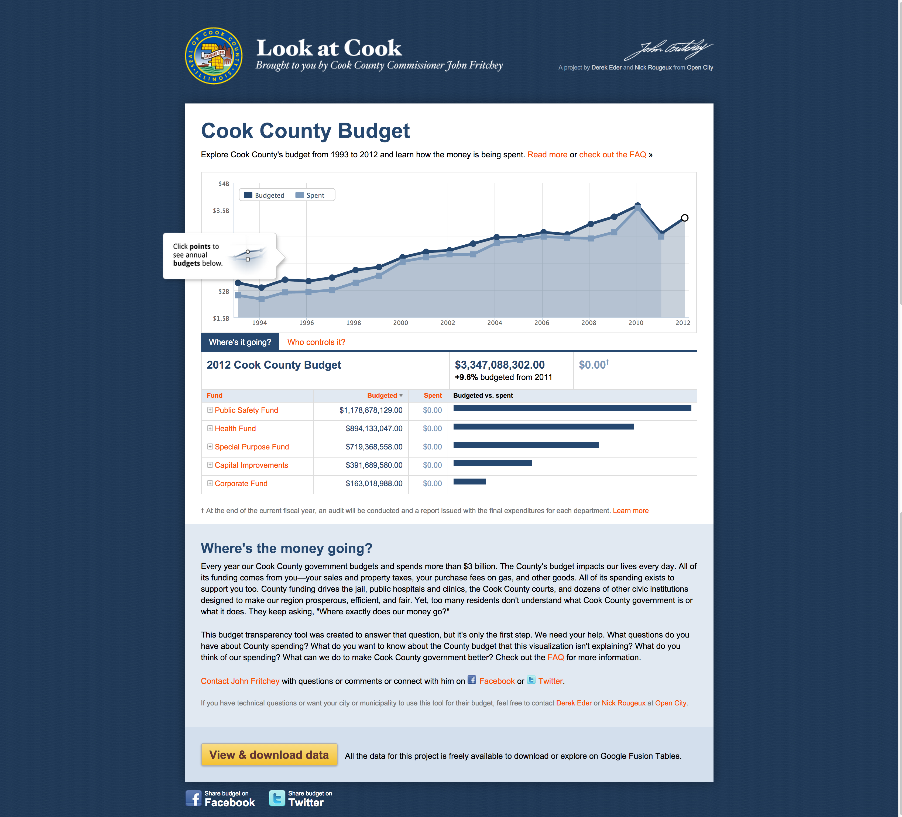

## Getting Started with Civic Application Development 

===

# Who the heck are you?

---

<h2>We build software to make data more useful to more people.</h2>

<!-- https://www.flickr.com/photos/hyku/2497370097 -->
--- 

<h2>We believe that greater access to public data makes cities better places to live</h2>

---

<h2>We make it easy for governments to share their public data with civic developers</h2>

===

# What kind of data is out there?

---

## Budgets & Spending

<!-- https://www.flickr.com/photos/e01/2334039881 -->

---

## Policing & Crime

<!-- https://www.flickr.com/photos/e01/2334039881 -->

---

## Health & Public Safety

<!-- https://www.flickr.com/photos/e01/2334039881 -->

---

## Transportation & Geospatial

<!-- https://www.flickr.com/photos/e01/233403988://www.flickr.com/photos/cdevers/8062581733 -->

===

# What can I build?

---

---

---

===

# The Socrata Open Data APIs

---

## Finding Data

### [dev.socrata.com/data/](http://dev.socrata.com/data/)

---

## Getting Help

### [dev.socrata.com](http://dev.socrata.com)

---

## API Endpoints

Format:

<code>https://$domain/resource/$identifier.$ext</code>

For more info: <a href="http://dev.socrata.com/docs/endpoints.html">dev.socrata.com/docs/endpoints.html</a>

---

### In the Data Catalog

---

## Simple Filters

<code>
/resource/abcd-1234.json?source=ConEd
</code>

<pre><code data-trim contenteditable class="javascript">
[ {
  "zipcode" : "10001",
  "source" : "ConEd",
  "location" : {
    "longitude" : "-73.99688630375988",
    "latitude" : "40.75025902143676",
  },
  "building_type" : "Commercial",
  "kwh" : "23328498"
}, ... ]
</code></pre>

For more info: <a href="http://dev.socrata.com/docs/filtering.html">dev.socrata.com/docs/filtering.html</a>

---

## SoQL Queries

<code>
/resource/abcd-1234.json? 
$where=kwh &gt; 80000
</code>

For more info: <a href="http://dev.socrata.com/docs/queries.html">dev.socrata.com/docs/queries.html</a>

---

## Geo Queries

<code>
/resource/abcd-1234.json? 
$where=within_circle(location, 47.61, -122.32, 500)
</code>

For more info: <a href="http://dev.socrata.com/docs/datatypes/location.html">dev.socrata.com/docs/datatypes/location.html</a>

---

## Paging Through Data

<code contenteditable>
/resource/abcd-1234.json? 
$limit=50 
&amp;$offset=100
</code>

The default $limit is 1000 and $offset starts at 0

For more info: <a href="http://dev.socrata.com/docs/paging.html">dev.socrata.com/docs/paging.html</a>

---

## Application Tokens

1. Register at [http://dev.socrata.com/register](http://dev.socrata.com/register)
2. Include as:
  - <code>X-App-Token: $token</code> HTTP Header or ... 
  - The <code>$$app_token=$token</code> parameter
3. ...
4. Profit!!! (from more API requests)

For more info: <a href="http://dev.socrata.com/docs/paging.html">dev.socrata.com/docs/paging.html</a>

===

# Help!

---

## Developer Portal

# [dev.socrata.com](http://dev.socrata.com)

Community powered! Learn how to <a href="http://dev.socrata.com/contributing.html">contribute</a>.

--- 

## Getting Help

- In person many events
- IRC: [chat.freenode.net/#socrata-soda](irc://chat.freenode.net/#socrata-soda)
- Stack Overflow: [soda](http://stackoverflow.com/questions/tagged/soda) or [socrata](http://stackoverflow.com/questions/tagged/socrata)

---

## Libraries & SDKs

### [dev.socrata.com/libraries/](http://dev.socrata.com/libraries/)

<a href="http://socrata.github.io/soda-ruby/">Ruby</a>, <a href="https://github.com/socrata/soda-scala">Scala</a>, <a href="http://socrata.github.io/soda-java/">Java</a>, <a href="https://github.com/socrata/soda-ios-sdk">iOS</a>, <a href="https://github.com/Chicago/RSocrata">R</a>, etc.

===

<h2 class="stroke-black">I'm ready to become fabulously successful!</h2>
<h3 class="stroke-black">Now what do I do?</h3>

---

<h2 style="color: black">Submit your app to the Socrata Apps Marketplace</h2>

---

## Benefits

- Exposure to citizen users
- Connections with our government customers
- Help developing and evangelizing data standards
- Additional support and mentoring

---

## Submitting your app

- Your contact info and details
- Background information on your app
- Details on licensing, fees, etc.

 

### [www.socrata.com/apps/submit-app/](http://www.socrata.com/apps/submit-app/)

---

## Socrata Certified Apps

---

## Socrata Certified Apps

- Requires an approved standard data schema
- Speeds acquisition & sales
- Builds confidence with buyers

===

<h2 class="stroke-black">One more thing...</h2>

<h1 class="fragment stroke-black" data-fragment-index="0">We're hiring!</h1>

<h2 class="fragment" data-fragment-index="1"><a href="http://www.socrata.com/careers">www.socrata.com/careers</a></h2>

===

# Thanks!
<h2 class="fragment">Any questions?</h2>
